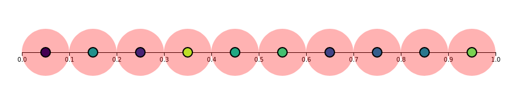

# Visualizing Sensor Placement

For this assignment we experimented with two different algorithms for placing wireless sensors in a 1-dimensional plane.

We used D3.js to draw an animated sensor bar that visualized the behavior of the two algorithms.

## Demo Video

Check out a demo video by clicking on the image of the sensor bar below:

## Instructions

1. Clone this repo.
2. Open `index.html`
3. That's it!
